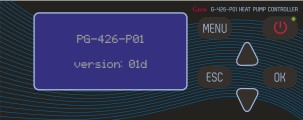

# hewalex-geco-protocol



Protocol reverse engineering and simple communication tool for GECO G-422 and G-426 range of solar and heat pump controllers, used also (but not only) in the Hewalex ZPS-series.

The **hewalex2mqtt.py** script will connect to a G-422 solar pump controller, request registers 100-250 and publish data to the MQTT broker.

Future support for the G-426 heat pump controller is planned but not implemented yet. For now heat pump support in this repo is limited to [documentation](docs/PCWU/). A [Domoticz plugin](https://github.com/mvdklip/Domoticz-Hewalex) has been made based on this. Both are work-in-progress.

## Configuration
You have to edit settings directly in the script.

On the top of the script file, you can change these 3 lines:

```
# change these data according to your needs
ser = serial.Serial('/dev/ttyUSB0', 38400)
mqttBroker ="127.0.0.1" 				# IP addres or DNS name of your MQTT broker
mqttPrefix="hewalex/"					# MQTT Topic prefix 
```
If you are connecting via some serial2ethernet converter (or rs485/ethernet converter like I am), you can use settings like this:
```
ser = serial.serial_for_url('socket://IP_ADDRESS_OF_CONVERTER:TCP_PORT')
```
For example:
```
ser = serial.serial_for_url('socket://192.168.0.12:6200')
```

Requests are hardcoded (asuming the controller's physical and also logical address is 2) so if you need to change them, you have to recalculate the CRC. 
I take it as working PoC. Currently I'm running it in cron from my armbian-based device and processing actual temperatures via MQTT to homeassistant.


It is possible to send configuration data to the controller, but I don't have the communication device for Ekontrol connection - this would require some sniffing on such installation. 

If you look at the demo of [Ekontrol](https://ekontrol.pl/en/33570/scheme/) by Hewalex, you can see pretty much what can be done with this system. They don't seem to have any public API for the Ekontrol interface, so there is that...

This work is inspired & based on informations provided on the elektroda.pl forum 
- https://www.elektroda.pl/rtvforum/topic3499254.html
- https://www.elektroda.pl/rtvforum/topic2792620.html
- https://www.elektroda.pl/rtvforum/topic2990515.html

so my thanks goes to these people :)
